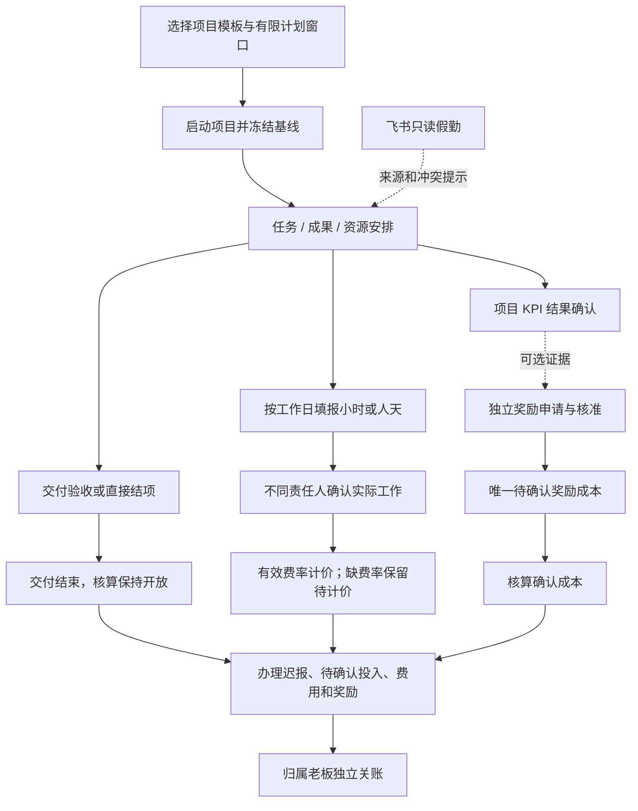

# P1–P4：三系统实施与验收记录

> 2026-09-08 持续经营功能合并：从旧未提交备份迁入每日预算/启动预算/重复收支、每日目标、任务恢复与执行区间、工作台项目筛选和奖金展示、权限及附件修复。兼容当前人员期间预算、实际工时、独立奖励和飞书规则；迁移重新编号 V069–V073。详见 [合并与验收记录](./持续经营功能合并与验收.md)。本次未升级现有业务库或部署线上。

> 2026-09-08 立项人员计划简化：参与方式支持“跟随项目／自定义时间／不限期”，计划工作量、单位和人天单位政策不再由立项人填写。人员预算统一按人员在当前预算期间内的完整工作日容量及有效内部费率估算；实际工作量仍在项目执行阶段填报并计价。不限期参与仅适用于不限期项目，数据库资源安排结束日期允许为空，但只物化当前预算期间的工作日计划。新增 V068 迁移，相关后端测试、前端构建与隔离浏览器交互验证通过。

> 2026-09-08 用人成本表单进一步简化：高级设置仅保留月／人天／小时计价方式，移除标准工作天数和费率分钟数输入。新成本版本由后台按人员档案地区固定月度基准：中国21.75天、越南26天；统一采用8小时人天，忽略客户端自定义基准。缺少适用地区时阻止保存月度成本并提示完善人员资料；历史版本与已计价快照继续使用原基准。129项相关后端测试、前端构建及隔离浏览器交互验证通过。

> 2026-09-08 预算与立项表单修正：预算区依次为“总预算（只读）／人员预算（只读）／业务预算（手填）”，总预算由后台按人员预算加业务预算重算，客户端合计无效。固定期限使用整个项目期间；不限期默认自然月，可选自然周或自然季度，周度按周一至周日，首期从项目开始日计算，明确保存期间起止，期满通过计划变更续编。人员总工作量先按参与窗口的工作日历分摊，再按预算期间内各日的有效费率计价，支持小时／日／月费率、假日和费率版本变化；未填日期的收入支出归入本期。本期支出明细不得超过业务预算；缺少／重叠费率、币种不符等显示待完善，可存草稿但不能启动。预算使用率按本期实际业务与人员成本计算，累计经营成本单独展示，预算到期提示续编。人员选择异步请求增加过期响应保护，失效人员保留日期和工作量；明细不再静默丢弃，补齐数值、长度和日期校验及草稿版本校验。预算规则使用现有 JSON 快照与金额字段，无新增数据库迁移。226 项后端测试、前端生产构建与隔离接口的真实浏览器交互验证通过；浏览器验证未写入业务库。

> 2026-09-07 立项流程调整：立项页面已取消项目模板选择，管理模式（轻量／标准／重点监管）与结项方式（直接／成果验收／阶段验收）独立选择。所有申请均由原申请人直接启动，包括已有受控模板草稿和待审批申请，无需老板审核。下文关于受控模板必须审批启动的描述属于此前验收记录；历史模板字段仅用于兼容已有计划及成本规则。结项验收、奖金核准与财务关账责任不变。此次调整不需要数据库迁移，前后端需同步更新。

> 同日补充：项目支持“不限期”，计划结束日期可为空，保存、启动及后续计划变更均保留该含义。人员计划独立填写有限参与起止日期，添加人员行不再要求先填项目结束日期。量化目标类型增加“数量”；立项表单和明细表补齐必填红星，结束日期、预算、监管原因等按选项动态标记。下文的强制有限项目窗口描述为此前版本行为，不再适用于当前实现。

> 更新：2026-09-07。同事协作分支为 `codex/three-system-product`，基于 `codex/system-baseline` 创建；生产尚未部署。本文是本轮开发交接入口，优先于改造前盘点及各批次文档中的阶段性“尚未迁移”说明。
> 定位：按通用管理模型改造的公司内部产品版本。三个业务系统共用现有平台、账号与部署，不代表三个独立服务，也不代表已完成跨客户验证的成熟标准产品。

## 1. 产品边界与菜单

项目管理负责目标、计划、资源、实际工作、项目指标及交付；人力资源负责人员、组织、独立奖金和只读假勤；财务与管理核算负责内部费率、收支、奖励成本及项目关账。平台与集成承载共享技术能力。直播、珠宝继续作为行业应用保留原业务口径。

| 系统 | 本轮入口 | 路由 / 页面 |
| --- | --- | --- |
| 项目管理系统 | 项目启动申请 | `/business/project-proposals` |
| 项目管理系统 | 项目中心、负责人工作台、我的工作 | 保留现有项目入口；详情新增计划基线与实际工作面板 |
| 项目管理系统 | 项目 KPI | 原项目 KPI 入口；新方案不自动生成奖金 |
| 项目管理系统 | 资源与实际工作 | `/business/resources` |
| 人力资源管理系统 | 人员、部门 | 原页面迁入 `/hcm`，不迁走人员管理主体 |
| 人力资源管理系统 | 奖金激励 | `/hcm/incentives` |
| 人力资源管理系统 | 假勤查询 | `/hcm/attendance` |
| 人力资源管理系统 | 假勤接入验收 | `/hcm/attendance-cutover` |
| 财务与管理核算系统 | 经营报表、项目核算与收支 | 原报表、核算页面迁入 `/finance` |
| 财务与管理核算系统 | 用人成本政策（内部费率） | `/finance/cost-policies` |
| 平台与集成 | AI、飞书连接与同步 | 共享平台入口；飞书为 `/platform/feishu` |

具体名称、父级、权限和路由以 [V067 导航迁移](../backend/sql/migrations/V067__three_system_product_navigation.sql) 和动态菜单为准。旧入口保留兼容跳转，不以书签地址作为业务授权。完整员工绩效没有伪装成已交付的空白菜单。

## 2. 已实现的闭环



### P1：交付与核算分开

项目 `status` 表达执行与交付，`accountingState=OPEN/CLOSED` 表达项目核算是否接受后续事项。新策略完成交付时保持核算开放；可继续办理执行期间合法迟报费用、投入、既有指标和奖励，清理待办后独立关账。真正关账后禁止普通修改，但财务筛选与项目核算看板继续支持查看历史；录入收支、手动重算及重试计价只面向核算开放的项目。旧项目保持原策略，已关账历史不自动重开。

### P2：模板、资源、实际工作与费率

新立项默认 `LIGHT_V1`，基础模板无预算、无人员费率、无 KPI、无奖金也可启动；`CONTROLLED_V1` 由不同的归属老板审核，`SERVICE_V1` 使用有限服务窗口。选择预算时检查已估算的外部支出。模板版本、原授权基线保存快照，计划变更产生新基线，预测独立保存。

人员参与日期与项目工期分开；资源计划支持小时、人天或容量比例。工作日历规定容量与节假日/半天例外，工作量单位政策单独规定分钟/人天；实际工作只按小时、人天录入，底层保存整数分钟。已确认记录更正产生新版本，旧版本保留且不会重复计价；本人或代填人不得确认同一工作记录。新项目的旧百分比、旧预算和相关 AI 确认入口被服务端阻断，不能再形成另一套人工成本来源。

新项目 `costPolicyVersion=ACTUAL_WORK_V1`，只按已确认工作与有效内部费率计价。确认事务生成耐久计价事件，核算失败保留待重试；缺费率、多重有效费率、币种不符保留待计价，金额为 null。费率支持月、日、小时；费率人天分母 `rateMinutesPerDay` 独立于填报显示单位，逐项最后按 `HALF_UP` 保留两位金额小数。工作量、费率版本、来源及舍入依据可追溯。

未填报显示未记录，不从计划回填实际，不当作零投入。当前关账待办统计已经存在的未完成记录；没有按资源计划自动生成逐日应报单或零工作声明。实际工作页面按工作日录入数量，尚无开始/结束时间区间自动跨夜拆分。

### P3：项目指标、奖励核准、成本确认分开

新 KPI 方案 `rewardPolicyVersion=INDEPENDENT_V1`，确认指标不生成奖金或成本。人力资源系统提供独立 `FIXED_V1` 奖励规则、测算、申请、退回、核准和历史记录，可引用本项目已确认独立指标作为证据。

奖励核准生成唯一 `HR_INCENTIVE / BONUS` 待确认成本，幂等键为 `HR-INCENTIVE-AWARD-{awardId}`；核算再次核对核准单据、金额、币种、日期、公司及实际责任人后确认。退回可按原金额重提；未入账撤销保留源单和事件。普通收支编辑及 AI 不能改写已核准的奖励来源。

旧 KPI 方案保留 `LEGACY_LINKED` 及原 `KPI-BONUS-SETTLEMENT-*` 来源，不用新奖励重复生成。奖励已核准、成本已确认、奖金已分配、工资已支付不是同一状态。个人分配、工资及支付反馈未实现。

### P4：飞书只读假勤与受控切换

已实现服务端适配器、显式人员映射与有效期、同步批次与分片、修订、异常待办、本人/组织查询和公司负责人验收切换。接口失败、缺项、未知班次或过期数据保留未知/部分/过期状态，不推断缺勤，不删除旧记录，不自动生成项目投入或成本。

现有飞书应用仍须配置服务端凭据、租户和读取员工范围。真实切换必须完成六类样本：正常出勤、已通过请假、更正/撤回、跨日、未映射或范围异常、故障恢复，并处理切换范围内本地遗留单据。技术管理员不能代替公司负责人验收。切换后页面、API、AI 都按真实业务日期停止相应本地请假办理；技术故障不会自动恢复双写。

## 3. 权限与责任

| 能力 | 权限与额外约束 |
| --- | --- |
| 实际工作 | `business:work:report`；范围内本人或授权代填。确认要求 `business:work:confirm` 并检查独立确认主体 |
| 资源与日历 | `business:resource:edit` 限项目责任人；`business:resource:config` 还检查技术管理员 |
| 内部费率 | `business:staff:cost` 与公司/项目范围同时满足；人员列表、项目、立项、核算响应均应遵守原价可见性 |
| 独立奖金 | `business:incentive:list/rule/apply/approve` 分离；仍核对实际主负责人、归属老板和申请人，角色不能代替对象责任 |
| 核算与关账 | 既有确认/重算权限与实际项目归属校验；独立关账权限 `business:accounting:close` |
| 假勤查询 | `business:attendance:self` 仅读本人；组织查询还要求 `business:attendance:read` 与负责人/显式组织范围 |
| 技术集成与业务切换 | `business:integration:feishu` 管技术；`business:attendance:cutover` 且实际公司负责人办理验收 |

V067 移除 `project_owner` 默认附带的原价权限。新增 `finance_cost_manager`、`hcm_incentive_operator`、`hcm_incentive_approver`、`attendance_reader`、`feishu_integrator` 角色，迁移不会自动把这些角色分配给员工。按真实岗位分配并刷新登录会话后再验收。技术权限不会自动扩展为假勤明细、奖励核准或财务业务签认权限。

## 4. 开发入口与数据对象

| 模块 | 接口 / 实现 |
| --- | --- |
| 项目启动与交付 | 既有 proposal/project API；`BusinessProjectProposalServiceImpl`、`BusinessProjectServiceImpl`、`BusinessProjectLifecycle` |
| 资源与实际工作 | `/business/project-work/options`、`/{projectId}/workspace`、`/{projectId}/assignments`、`/{projectId}/entries`、逐单提交/确认/更正/历史；`BusinessProjectWorkService` |
| 基线变更与预测 | `/business/project-work/{projectId}/plan`、`plan-changes`、`forecast`；`BusinessProjectPlanService` |
| 计价与内部费率 | `/business/project-work/{projectId}/reprice`；`BusinessProjectWorkPricingService`；`GET /business/staff/cost-options` 及现有成本政策 API |
| 独立奖励 | `/business/incentive/workspace`、`rule`、`estimate`、`award` 及逐单操作；`BusinessIncentiveServiceImpl` |
| 假勤与飞书 | `/business/feishu` 下的连接、映射、同步、来源、验收和切换接口；`attendance/BusinessFeishuService` |
| AI | 新增实际工作、计划和奖金只读能力；旧预算/比例写能力按项目策略守卫，既有业务写入仍复用相同最终服务端校验 |

P2 新表保存模板、日历/单位、计划基线/变更/预测、资源计划及逐日容量、实际工作/审计/事件/计价依据。P3 新表为 `biz_incentive_rule/award/event`；P4 新表为 `biz_feishu_*` 连接、身份、同步、来源修订、授权与审计。精确字段以迁移与 Mapper 为准，不使用文档创建平行数据模型。

详细接口与业务规则见 [P1](./P1-交付与核算解耦实施记录.md)、[P2](./P2-资源投入与成本计价实施记录.md)、[P3](./P3-项目指标与独立奖金激励实施记录.md)、[P4 配置与联调手册](./P4-飞书接入配置与联调手册.md)。

## 5. 迁移与本地证据

在现有 V062 基础上，按 `V063 → V064 → V065 → V066 → V067` 顺序应用，前后端必须配套。V063 为独立交付/关账，V064 为模板和工作计价，V065 为独立奖励，V066 为飞书来源，V067 为三系统导航与独立角色。先备份、复制库预演，再运行只读预检与 [verify_business_schema.sql](../backend/sql/migrations/verify_business_schema.sql)，核对旧记录及新增对象完整性。

本地 `localhost / ry-vue` 已完成 V064–V067 复制库重复执行验证并应用；已有业务列哈希保持一致。最新迁移证明为本机忽略目录 `logs/product_migration_verification_20260907_153949.json`，不提交仓库。V064 包含费率人天分母及月度标准天数允许 null 的最终定义；已有月度分母保留原值。迁移没有自动启用飞书连接或切换公司。

成本 SQL 修改前已核对本地真实旧比例样本；真实隔离 API 验证已确认基础模板可无预算、无费率启动，确认 `0.5` 人天得到 `240` 分钟，缺费率时先保留待计价。首次计划变更发现的“项目基线为 0、初始快照为 1”缺陷已修复：新标准项目及初始快照统一从 1 开始，首次变更递增到 2；旧基线默认 0 保持不变，并补生产 Mapper 回归。

## 6. 验收记录与交付状态

| 项目 | 当前证据 / 状态 |
| --- | --- |
| 后端测试 | 最终 Maven `clean test package` 成功；63 套报告共 546 项，实际执行 529 项全部通过、17 项跳过，零失败零错误。跳过项均为历史停用的老板 AI 直接创建项目流程，原有 `@Disabled`，不计入本轮通过项。证明：本地忽略目录 `logs/product-final-test-summary.json`、`logs/product-final-tests.log` |
| 后端制品 | 最终清理后重新打包成功，避免增量制品残留旧模块；以最后完整制品和对应代码交接 |
| 前端 | `pnpm run build:prod` 成功，证明 `logs/product-frontend-build.log` |
| 数据库 | 复制库重复迁移、localhost 应用、旧业务列哈希核对完成。完整 `verify_business_schema.sql` 共 70 组结果，本地 `ry-vue` 全部 0 异常；隔离 QA 库仅合成账号/公司缺少完整 profile 或岗位配置的 3 组既有检查非零，新 P1–P4 检查无异常。证明 `logs/product-schema-verification.json` |
| 实际业务 API | 隔离验收全绿，证明 `logs/product-api-acceptance.json`。三模板启动成功（受控模板先 PENDING，再由归属老板批准）；交付 CLOSED、核算 OPEN 后更正仍可办理，更正待确认时原人工成本保持 200，确认 0.25 人天后人工成本 100，加独立奖金成本 100 合计 200。独立关账成功后实际工作写入被拒绝；无费率确认工作的 pendingCostCount=1；已关账项目历史筛选保留，重算仍被拒绝；受控模板计划变更需独立审批，确认前不改基线 |
| 页面检查 | 已实际看到 0.50 人天/240 分钟、无预算启动表单、待计价 1 与重试入口、奖励已核准/成本已确认/支付未记录及关账只读；带项目参数打开历史核算会自动预选，录入弹窗不会默认选入已关账项目，保存按钮保持禁用直到用户明确选择开放项目。已实际切换越南语核对奖金、关账及假勤验收页面；窄屏核算页显示正常。浏览器最终检查未出现新的业务脚本异常（历史会话过期日志来自测试后端重启） |
| 飞书真实企业 | 适配器与模拟回归已实现；服务端授权、真实员工范围和六类样本仍待配置与验收 |
| 生产发布 | 通过独立协作分支交接；未合并原分支、未部署服务器，代码与菜单不等于服务器已上线 |

权限场景同时验证：负责人核算视图只返回目标项目及所属公司，不返回其他公司目录；飞书未配置时仅建立隔离 QA 并行连接，真实样本 0/6 时切换被拒绝；归属老板读模型不包含技术租户信息，其他公司老板不能读取该连接，普通员工无来源记录时返回空列表。QA 并行连接不代表真实飞书接入成功。以上日志均为本地忽略文件，不提交个人数据、凭据或运行日志。

交接给同事时提供仓库当前完整变更、迁移顺序、本文及分模块记录。先确认目标库和现有版本，在复制库执行迁移并跑回归，再分配实际岗位权限、检查关键用户路径。不能只凭设计文档让另一个开发者重做一套数据模型，也不能把内部一次联调当作对外标准产品认证。

完整 HR 绩效周期、个人奖金分配、薪资发放与支付反馈、企业会计期间/总账、跨客户租户隔离和跨夜工作区间自动拆分不在 P1–P4 已实现范围。回退应暂停新增写入并保留新策略读写兼容及审计数据，不删除新表、不把确认工时倒算回比例、不批量重开历史关账。

## 7. 本地预览

本地预览为 `http://localhost:81`，后端使用原本地 `ry-vue` 业务库；测试账号、模板项目、费用和飞书并行连接只保留在隔离 QA 库，不混入业务库。使用原账号登录。当前开发环境通过临时本机转发连接现有 WSL Redis；启动信息保存在忽略的 `logs/product-local-preview.json`。正常重启前请确认 MySQL/Redis 可达，必要时按本机实际情况设置 `REDIS_PORT`；`start-dev.bat --headless` 支持隐藏窗口启动，后端未运行时先清理并重建制品。此本地预览不代表生产部署。

## 8. 同事接手此分支

仓库：`https://github.com/Chenbboo/ai-streamer-stats`。本轮代码、测试、V063–V067 迁移及设计文档集中在 `codex/three-system-product`；原 `codex/system-baseline` 保留不动。

在已有仓库中拉取并首次切换：

```bash
git fetch origin
git switch --track origin/codex/three-system-product
```

先阅读本文、`AGENTS.md` 和 `backend/sql/migrations/README.md`，按目标数据库当前版本确定待执行迁移，在复制库预演后再应用。不要把本机验收已应用迁移当作同事数据库也已更新。前后端继续使用现有 Vue/RuoYi 架构；本地运行日志、备份、隔离测试账号和授权密钥不在分支中。

接续重点是企业飞书授权、真实人员映射及六类样本验收，以及内部用户试用反馈。飞书 App Secret 放在服务端环境变量，切换须满足业务验收条件。提交此分支不代表获准合并主线或部署服务器。
