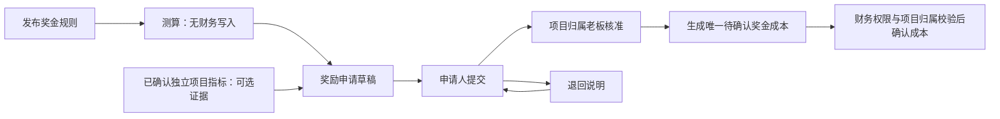

# P3：项目指标与独立奖金激励实施记录

> 2026-09-09 后续扩展：个人奖金分配及由老板登记实付已另行实现，见[奖金分配与发放实施记录](./奖金分配与发放实施记录.md)。下文未记录个人分配／支付的描述属于早期 P3 范围。

> 日期：2026-09-07。本文记录本地实现范围；本地 MySQL 迁移预演、应用与重复执行校验已完成，尚未生产部署。测试执行结果以本轮总验收记录为准。个人绩效、奖金分配、工资及支付反馈不属于本轮实现。

## 已实现的业务边界

### 2026-09-08：项目 KPI 设置页面收敛

根据本次页面用途调整，项目 KPI 默认入口仅维护指标、目标、权重、周期及方案发布／作废。方案历史展示发布时的指标快照，移除交付与核算面板、结果填报、结算状态、综合得分和奖金展示。

原结果填报、确认及历史审核复用既有处理逻辑，改由 `/projects/kpi-results` 独立页面承接。项目结算面板、老板审核待办及有方案的项目结果入口跳转到结果页；设置与发布待办仍进入 KPI 设置页。沿用 `business:kpi:list` 及既有写操作权限，未变更后端计算、确认、历史兼容或核算规则。

本地使用截图项目验证设置页面、发布弹窗、独立结果路由及项目切换；前端生产构建通过。验证未发布新方案或修改项目业务数据。原 KPI 页面尚无越南语内容；结算面板现有中越文入口共用更新后的路由。

发布方案选择“项目周期”时，页面只读展示项目计划起止日期，服务端从项目记录取得日期后再校验周期重叠并保存快照。项目日期缺失或顺序无效时禁止发布，不以今天补齐，也不接受客户端另设的日期范围。月度与季度仍可选择考核日期；已发布方案的日期快照保持不变。

新发布项目 KPI 方案固定 `rewardPolicyVersion=INDEPENDENT_V1`、`bonusMode=NONE`，采用项目本位币，不要求人民币奖金阶梯。项目主负责人确认指标，只保存指标结果、确认身份和方案关闭状态，不生成奖金或成本。外部提交旧策略字段不能把新方案改回奖金联动。

V065 为存量方案增加 `LEGACY_LINKED` 默认标识，不更新既有金额、审批人、状态或会计来源。原负责人确认、历史老板审核以及退回重提继续按原路径处理；`KPI-BONUS-SETTLEMENT-*` 来源保留。已确认自动指标返回保存的结果快照，后续奖励成本变化不会改变该确认结果的呈现。

新独立方案使用实际投入成本方法时，若项目存在待计价投入，人员成本或利润自动指标显示待计价、数值和综合得分为空，禁止确认；其他手工指标仍可先保存。首发采用**全项目待计价数**作为保守判断，并非仅统计当前 KPI 周期。历史联动方案保留原计算方式。

奖金激励位于人力资源系统，管理独立规则、测算、奖励申请和核准。早期 `FIXED_V1` 固定金额规则继续保留兼容；当前页面新发布使用下述 `SCORE_TIERS_V1`。每次发布生成新规则版本，不覆盖旧申请快照。

### 2026-09-08：按项目 KPI 得分配置奖金

奖金页面默认进入“KPI 得分与奖金设置”，关联本项目已发布的独立 KPI 方案，维护综合得分区间和每档奖金，并提供假设得分预览。“奖励申请与核准”保留在独立页签，不再在设置页面展示交付核算面板。

- 新规则为 `SCORE_TIERS_V1`，固定关联 `kpiPlanId` 和发布时的阶梯。得分范围沿用 KPI 综合得分的 0–120 分，区间从 0 分连续排列，下限包含、上限不含，最后一档无上限；每次只匹配一档。
- 奖金采用项目本位币，可设置 0 元档，至少一档金额大于 0。`amount` 在新规则头中仅保留各档最大金额，实际奖金只能从阶梯和已确认分数匹配取得；历史 `FIXED_V1` 仍按原固定金额解释。
- 同一 KPI 方案发布新奖金规则时，旧阶梯规则自动停用。已创建申请继续保留原规则版本、分数和金额；旧规则停用不妨碍既有申请核准。
- 测算和申请必须引用关联方案的已确认独立 KPI 结果，不能用其他项目、其他方案、未确认或历史联动结果替代。页面模拟分数只用于预览，不作为申请依据。
- 命中 0 元档时可查看测算，不生成奖励申请或成本。该 KPI 结果已有未撤销阶梯奖励申请时，换规则版本或请求标识不能重复申请。
- 核准再次核对原版本、分数与金额，只生成待确认成本；既有核准人、申请人、管理员及财务权限边界不变。

V076 新增规则的 `kpi_plan_id` 及 `biz_incentive_tier` 表，保留旧规则、单据及金额。本地已备份并在隔离库重复预演后应用，存量数据哈希不变，证据见忽略目录 `logs/score_bonus_migration_20260908_174528.json`。本地后端已重启加载更新，生产尚未部署。

验证：奖金服务、Mapper、核算、项目关闭和 KPI 服务共 86 项测试通过；前端构建通过。页面使用隔离数据验证 99.99／100 分的档位切换及中越文显示，未向业务项目发布测试奖金规则或创建奖励申请。

### 2026-09-08：修复项目负责人缺少奖金设置入口

项目主负责人已能维护 KPI，但此前奖金设置仍限定归属老板，导致已发布 KPI 的项目在奖金页仅显示空表。现在发布／停用规则接受 `business:incentive:rule` 或 `business:kpi:manage`，服务端同时限制为该项目实际主负责人、归属老板或显式管理员，不给普通成员或仅创建者跨项目配置能力。无需给当前账号追加老板角色或奖励核准权限。

页面展示明确的“设置奖金方案”按钮。缺少权限、项目不在执行中或核算关闭时，按钮禁用并显示原因；缺少已发布 KPI 时保留前往 KPI 设置的提示。奖励核准、成本签认和禁止自批继续独立校验。服务测试覆盖负责人、归属老板、管理员、仅创建者及跨项目用户，控制器测试检查设置权限与核准权限分离。

### 2026-09-09：奖金方案名称与得分公式说明

奖金页面的“奖金规则”统一改称“奖金方案”，同步调整发布、停用、状态及版本提示。名称输入框增加示例，明确填写方案名称。设置弹窗在档位上方直接展示正向／反向指标得分公式、0–120 分限制、反向实际值为 0 的处理、加权汇总和两位小数四舍五入顺序，并给出明确标注为示例的 90 分计算过程。

公式已核对 `BusinessProjectKpiServiceImpl` 的 `completionRate`、`weightedScore` 和 `totalScore`，说明使用关联 KPI 方案的发布快照；此次只调整中越文展示，不改计算或业务数据。前端生产构建及现有奖金预览边界、语言键一致性校验通过。

## 奖励单据与成本

- 申请固定规则版本、金额、币种、业务日期、依据及可选指标得分快照；客户端不能填写审批人或已确认成本。
- 同一项目的 `requestKey` 唯一，重复请求返回原单，改变请求内容会被拒绝。同一规则与指标证据的非撤销奖励不得用其他请求标识再次申请。
- 仅引用本项目已确认的 `INDEPENDENT_V1` 指标。旧奖金联动指标不能再作为独立奖励来源。
- 核准生成 `sourceDomain=HR_INCENTIVE`、`sourceType=BONUS`、`sourceId=awardId` 的 `DRAFT` 成本事实，唯一键为 `HR-INCENTIVE-AWARD-{awardId}`。奖励服务不调用成本确认或重算，不把核准状态当作入账。
- 奖励状态为 `DRAFT/SUBMITTED/RETURNED/APPROVED/CANCELED`；成本状态读取关联事实；个人分配及支付始终显示 `NOT_RECORDED`。
- 成本尚未确认时，归属老板可有原因地撤销已核准奖励，原成本标记 `VOIDED` 并保留事件。已确认或已冲销成本不能直接撤销原奖励或删除历史。
- 成本被退回后，归属老板可附说明按原核准金额重新提交成本，保持原审批人和时间。金额改变须撤销未入账原单并建立新申请；已入账变更须走核算调整。

所有奖励写入先锁定同一项目行，再检查项目核算状态、对象状态和单据版本；奖励与来源事实在同一事务中更新。项目交付后只接受执行期间合法业务日期；核算关闭后禁止普通修改。未完成奖励申请参与独立关账待办。

## 角色与权限

| 操作 | 权限 | 对象身份限制 |
|---|---|---|
| 查看奖金及历史池 | `business:incentive:list` | 主负责人、归属老板；显式管理员可查询；普通成员及其他公司用户不得查看金额 |
| 发布或停用规则 | `business:incentive:rule` 或 `business:kpi:manage` | 实际主负责人、归属老板；显式管理员可维护配置 |
| 创建、提交奖励 | `business:incentive:apply` | 实际主负责人；重提须为原申请人 |
| 核准或退回 | `business:incentive:approve` | 实际归属老板，不得审核本人申请；技术管理员身份不代替业务核准 |
| 重新提交退回成本 | `business:incentive:approve` | 实际归属老板，原金额及币种不变 |
| 确认成本 | 核算既有专用权限 | 核算服务再次核对实际项目归属与核准来源 |

同一账号同时担任主负责人和归属老板的项目，不提供自批奖励捷径；须先明确实际业务职责分离。本轮不通过管理员自动代批解决。

## 接口与读模型

统一前缀 `/business/incentive`：

| 接口 | 关键输入 |
|---|---|
| `GET /workspace` | 可选 `projectId`；返回授权项目目录、规则、奖励、独立指标证据、历史奖金和审计 |
| `POST /rule` | `projectId, ruleName, amount, currency, minScore?, reason` |
| `POST /rule/{ruleId}/retire` | `reason` |
| `POST /estimate` | `projectId, ruleId, settlementId?`；仅测算 |
| `POST /award` | `projectId, ruleId, settlementId?, bizDate, reason, requestKey` |
| `POST /award/{awardId}/submit` | `version, reason` |
| `POST /award/{awardId}/review` | `version, decision=APPROVED/RETURNED, reason` |
| `POST /award/{awardId}/cancel` | `version, reason` |
| `POST /award/{awardId}/resubmit-cost` | `version, reason` |

奖励读模型提供 `canSubmit/canReview/canCancel/canResubmitCost` 和单据 `events`，页面同时检查操作权限。AI 新增 `incentive.workspace.get` 只读查询，复用同一权限和项目范围，不新增自动核准、分配或付款能力。

## 验证与迁移边界

新增服务测试覆盖创建者、主负责人、成员、跨项目/公司用户、归属老板、技术管理员，独立指标无奖金确认、旧联动兼容、冻结快照、版本冲突、重复来源、关账拒绝、未入账撤销和成本重提。Mapper 集成测试执行 V065 建表语句和生产 MyBatis SQL，验证权限目录、唯一请求键、乐观锁、来源状态及保留历史；控制器和 AI 增加专用权限测试。

奖励与核算交叉验证另设 `BusinessIncentiveAccountingTest`（18 项）和 `BusinessIncentiveProjectCloseTest`（6 项），已通过聚焦执行。覆盖技术管理员、创建者和负责人不能替代归属核算签认，来源金额、币种、日期、公司、类别和唯一键必须匹配核准快照，确认重试不重复记账，退回与冲销保留原核准，关账锁定项目后再次检查待办奖励和成本。此前 P3 服务、Mapper、KPI、AI 和控制器聚焦执行共 55 项通过；全量测试状态以总验收记录为准。

本地 MySQL 迁移证据见 [迁移验证记录](../logs/product_migration_verification_20260907_153949.json)：保留本地备份，业务数据内容不变，重复迁移无额外变化。迁移已在本地应用，生产部署尚未执行。

本地真实 API 已验证独立 KPI 确认得分 100，奖励核准仅生成成本草稿，技术管理员不能代替业务核准，归属业务责任人可确认成本且重复确认保持幂等。实际样本中 `0.5 人天 = 240 分钟`，按时费率 50 计得人员成本 200；再加入已单独确认的奖励成本 100，核算成本合计为 300。

V065 只增加字段和新表；三个系统的菜单权限由统一导航迁移安装。回退应停止新流程写入并保留新表、已核准单据、来源事实及兼容读写能力，不删新记录或用旧服务重新解释独立方案。真实页面联调及生产部署结果仍须在总验收记录中分别确认，不能由 H2 或模拟测试替代。
