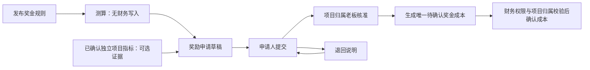

# P3：项目指标与独立奖金激励实施记录

> 日期：2026-09-07。本文记录本地实现范围；本地 MySQL 迁移预演、应用与重复执行校验已完成，尚未生产部署。测试执行结果以本轮总验收记录为准。个人绩效、奖金分配、工资及支付反馈不属于本轮实现。

## 已实现的业务边界

新发布项目 KPI 方案固定 `rewardPolicyVersion=INDEPENDENT_V1`、`bonusMode=NONE`，采用项目本位币，不要求人民币奖金阶梯。项目主负责人确认指标，只保存指标结果、确认身份和方案关闭状态，不生成奖金或成本。外部提交旧策略字段不能把新方案改回奖金联动。

V065 为存量方案增加 `LEGACY_LINKED` 默认标识，不更新既有金额、审批人、状态或会计来源。原负责人确认、历史老板审核以及退回重提继续按原路径处理；`KPI-BONUS-SETTLEMENT-*` 来源保留。已确认自动指标返回保存的结果快照，后续奖励成本变化不会改变该确认结果的呈现。

新独立方案使用实际投入成本方法时，若项目存在待计价投入，人员成本或利润自动指标显示待计价、数值和综合得分为空，禁止确认；其他手工指标仍可先保存。首发采用**全项目待计价数**作为保守判断，并非仅统计当前 KPI 周期。历史联动方案保留原计算方式。

奖金激励位于人力资源系统，管理独立规则、测算、奖励申请和核准。当前标准规则为 `FIXED_V1`：固定金额、项目本位币、可选最低项目指标得分。每次发布生成新规则版本，原版本只能停用，不覆盖旧申请快照。

## 奖励单据与成本

- 申请固定规则版本、金额、币种、业务日期、依据及可选指标得分快照；客户端不能填写审批人或已确认成本。
- 同一项目的 `requestKey` 唯一，重复请求返回原单，改变请求内容会被拒绝。同一规则与指标证据的非撤销奖励不得用其他请求标识再次申请。
- 仅引用本项目已确认的 `INDEPENDENT_V1` 指标。旧奖金联动指标不能再作为独立奖励来源。
- 核准生成 `sourceDomain=HR_INCENTIVE`、`sourceType=BONUS`、`sourceId=awardId` 的 `DRAFT` 成本事实，唯一键为 `HR-INCENTIVE-AWARD-{awardId}`。奖励服务不调用成本确认或重算，不把核准状态当作入账。
- 奖励状态为 `DRAFT/SUBMITTED/RETURNED/APPROVED/CANCELED`；成本状态读取关联事实；个人分配及支付始终显示 `NOT_RECORDED`。
- 成本尚未确认时，归属老板可有原因地撤销已核准奖励，原成本标记 `VOIDED` 并保留事件。已确认或已冲销成本不能直接撤销原奖励或删除历史。
- 成本被退回后，归属老板可附说明按原核准金额重新提交成本，保持原审批人和时间。金额改变须撤销未入账原单并建立新申请；已入账变更须走核算调整。

所有奖励写入先锁定同一项目行，再检查项目核算状态、对象状态和单据版本；奖励与来源事实在同一事务中更新。项目交付后只接受执行期间合法业务日期；核算关闭后禁止普通修改。未完成奖励申请参与独立关账待办。

## 角色与权限

| 操作 | 权限 | 对象身份限制 |
|---|---|---|
| 查看奖金及历史池 | `business:incentive:list` | 主负责人、归属老板；显式管理员可查询；普通成员及其他公司用户不得查看金额 |
| 发布或停用规则 | `business:incentive:rule` | 归属老板；显式管理员可维护配置 |
| 创建、提交奖励 | `business:incentive:apply` | 实际主负责人；重提须为原申请人 |
| 核准或退回 | `business:incentive:approve` | 实际归属老板，不得审核本人申请；技术管理员身份不代替业务核准 |
| 重新提交退回成本 | `business:incentive:approve` | 实际归属老板，原金额及币种不变 |
| 确认成本 | 核算既有专用权限 | 核算服务再次核对实际项目归属与核准来源 |

同一账号同时担任主负责人和归属老板的项目，不提供自批奖励捷径；须先明确实际业务职责分离。本轮不通过管理员自动代批解决。

## 接口与读模型

统一前缀 `/business/incentive`：

| 接口 | 关键输入 |
|---|---|
| `GET /workspace` | 可选 `projectId`；返回授权项目目录、规则、奖励、独立指标证据、历史奖金和审计 |
| `POST /rule` | `projectId, ruleName, amount, currency, minScore?, reason` |
| `POST /rule/{ruleId}/retire` | `reason` |
| `POST /estimate` | `projectId, ruleId, settlementId?`；仅测算 |
| `POST /award` | `projectId, ruleId, settlementId?, bizDate, reason, requestKey` |
| `POST /award/{awardId}/submit` | `version, reason` |
| `POST /award/{awardId}/review` | `version, decision=APPROVED/RETURNED, reason` |
| `POST /award/{awardId}/cancel` | `version, reason` |
| `POST /award/{awardId}/resubmit-cost` | `version, reason` |

奖励读模型提供 `canSubmit/canReview/canCancel/canResubmitCost` 和单据 `events`，页面同时检查操作权限。AI 新增 `incentive.workspace.get` 只读查询，复用同一权限和项目范围，不新增自动核准、分配或付款能力。

## 验证与迁移边界

新增服务测试覆盖创建者、主负责人、成员、跨项目/公司用户、归属老板、技术管理员，独立指标无奖金确认、旧联动兼容、冻结快照、版本冲突、重复来源、关账拒绝、未入账撤销和成本重提。Mapper 集成测试执行 V065 建表语句和生产 MyBatis SQL，验证权限目录、唯一请求键、乐观锁、来源状态及保留历史；控制器和 AI 增加专用权限测试。

奖励与核算交叉验证另设 `BusinessIncentiveAccountingTest`（18 项）和 `BusinessIncentiveProjectCloseTest`（6 项），已通过聚焦执行。覆盖技术管理员、创建者和负责人不能替代归属核算签认，来源金额、币种、日期、公司、类别和唯一键必须匹配核准快照，确认重试不重复记账，退回与冲销保留原核准，关账锁定项目后再次检查待办奖励和成本。此前 P3 服务、Mapper、KPI、AI 和控制器聚焦执行共 55 项通过；全量测试状态以总验收记录为准。

本地 MySQL 迁移证据见 [迁移验证记录](../logs/product_migration_verification_20260907_153949.json)：保留本地备份，业务数据内容不变，重复迁移无额外变化。迁移已在本地应用，生产部署尚未执行。

本地真实 API 已验证独立 KPI 确认得分 100，奖励核准仅生成成本草稿，技术管理员不能代替业务核准，归属业务责任人可确认成本且重复确认保持幂等。实际样本中 `0.5 人天 = 240 分钟`，按时费率 50 计得人员成本 200；再加入已单独确认的奖励成本 100，核算成本合计为 300。

V065 只增加字段和新表；三个系统的菜单权限由统一导航迁移安装。回退应停止新流程写入并保留新表、已核准单据、来源事实及兼容读写能力，不删新记录或用旧服务重新解释独立方案。真实页面联调及生产部署结果仍须在总验收记录中分别确认，不能由 H2 或模拟测试替代。
