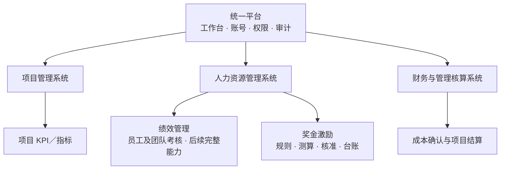
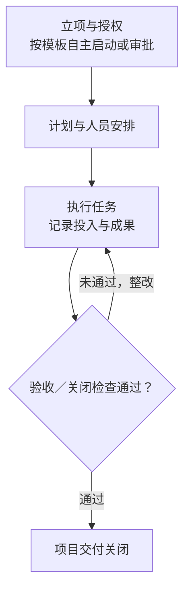
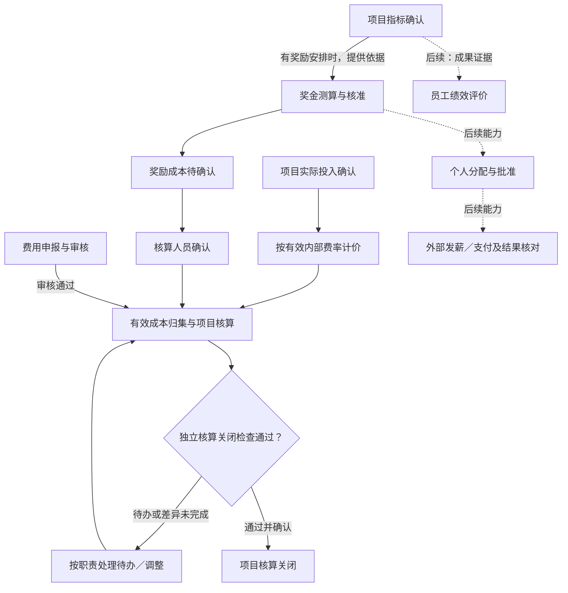

# 三系统拆分方案：审阅版

> 版本：v1.0｜日期：2026-09-07
> 用途：供业务负责人审阅模块边界、菜单、流程和实施范围
> 状态：总体设计稿；P1 交付与核算解耦已本地实现，见 [实施记录](./P1-交付与核算解耦实施记录.md)；三系统菜单及飞书尚未交付
> 当前目标：先支持公司内部使用，沿用通用业务模型；对外标准产品的配置交付与跨客户验证另行完善

## 1. 先明确系统数量

统一平台下，拆成三个业务子系统：**项目管理系统、人力资源管理系统、财务与管理核算系统**。

三个系统分别负责业务，继续共用登录、账号、权限基础设施、工作台和审计。不要求建设三套独立网站、重新建立三套员工账号或立即拆成独立服务。

KPI 和奖金设置清楚的功能入口：项目 KPI 在项目系统，员工绩效与奖金激励在人力资源系统中分别设独立模块。此前提出的五个平级业务入口不纳入本版菜单方案。

原有直播运营和珠宝进销存作为两个行业应用保留，不计入本次三个通用管理系统的数量；它们仍维护各自业务事实和权限。



## 2. 三个系统各管什么

| 系统 | 要解决的业务问题 | 主要功能 | 边界 |
|---|---|---|---|
| 项目管理系统 | 做什么、谁来做、何时交付、投入多少 | 立项、计划、任务、人员安排、实际投入、风险、项目 KPI、验收与关闭 | 不办理请假；不把项目指标直接当成员工评价或奖金批准 |
| 人力资源管理系统 | 谁参与工作、人员表现如何、奖励怎样确定 | 组织人员、绩效管理、奖金激励、外部假勤查询 | 绩效与奖金分别有权限和流程；假勤在飞书办理 |
| 财务与管理核算系统 | 预算多少、发生哪些费用、成本多少、何时结清 | 预算、收支、费率、人员成本、奖励成本、项目核算和经营报表 | 奖励核准后仍需按规则确认成本；不把成本入账当作已付款 |

名称描述目标业务范围。首轮的人力资源和管理核算只建设本方案列明的能力，不代表交付完整招聘、工资税费、总账或银行支付系统。

## 3. 目标菜单

菜单按三个系统组织；带“后续”的功能只说明归属，未实现时不展示可操作空页面。

```text
统一工作台
├─ 项目管理系统
│  ├─ 项目列表与立项
│  ├─ 计划、任务与里程碑
│  ├─ 人员安排与实际投入
│  ├─ 项目 KPI／指标
│  ├─ 风险、问题与变更
│  └─ 成果验收与项目关闭
├─ 人力资源管理系统
│  ├─ 组织与人员
│  ├─ 绩效管理（员工及团队考核，后续完整能力）
│  ├─ 奖金激励
│  │  ├─ 奖金方案与测算
│  │  ├─ 奖励核准与奖金台账
│  │  └─ 个人分配（后续）
│  └─ 飞书假勤查询（只读）
└─ 财务与管理核算系统
   ├─ 预算与测算
   ├─ 费用和收支记录
   ├─ 成本政策与人员成本
   ├─ 奖励成本与项目结算
   ├─ 经营报表
   └─ 支付记录／外部发薪结果（后续集成）

原有行业应用：直播运营、珠宝进销存
共享管理入口：账号权限、流程模板、飞书连接与人员映射、同步记录、审计
```

项目负责人可从项目详情跳转到有权查看的奖金、成本与人员信息；跳转不转移数据的维护职责，也不放开其他人员的绩效、薪酬或跨公司数据。

## 4. KPI、绩效、奖金与付款分别归属

| 内容 | 所属模块 | 示例 | 与其他模块的关系 |
|---|---|---|---|
| 项目 KPI／指标 | 项目管理 | 项目完成量、交付质量、周期目标 | 可以作为人员评价或奖励的证据；没有奖金也能确认指标 |
| 员工／团队绩效 | 人力资源 → 绩效管理 | 员工周期目标、评价、复核和发布结果 | 可引用项目成果，不把项目总分直接复制成每位成员的得分 |
| 奖金激励 | 人力资源 → 奖金激励 | 奖励规则、奖金池测算、核准金额 | 项目或绩效结果可作依据；绩效确认不自动等于奖励核准 |
| 个人奖金分配〔后续〕 | 人力资源 → 奖金激励 | 受益员工、分配金额、分配批准 | 分配不得超过适用核准金额，形成可供工资／支付系统处理的依据 |
| 奖励成本 | 财务与管理核算 | 待确认成本来源、确认金额、更正与冲正 | 引用奖励核准记录，同一奖励不得因分配或支付再次计成本 |
| 支付记录〔后续〕 | 财务与管理核算／外部工资支付系统 | 支付金额、日期、状态、凭证 | 核准、成本确认和支付各有状态；人力端按权限引用支付结果 |
| 经营指标 | 原业务系统／管理核算及经营报表 | 营收、利润、回款、库存等 | 原始事实留在业务来源；用于人员考核时引用有口径和版本的结果 |

当前已有的是项目 KPI 与项目奖金池，完整员工绩效和个人发放尚不存在。迁移不得仅靠改名把旧项目结果变成员工评价、把奖金池变成已支付给个人的工资。

## 5. 项目流程与后续办理



正常项目允许没有 KPI 奖励方案。交付关闭按适用模板检查成果、遗留事项及交接，不把员工绩效、奖金或未来周期结果写成所有项目的统一门槛。

项目交付关闭后，既有周期的指标、奖励和合法迟报费用可继续按各自规则办理。涉及金额时，仍需满足项目核算开放状态和适用期间规则；已经关闭的历史账不批量重开。



箭头表示资料和事实传递，不表示一个按钮自动批准所有后续业务。员工绩效、个人分配、支付是后续能力；它们不作为首批 P1 的交付承诺。

## 6. 人员投入和飞书考勤

- **计划安排**：每个人有自己的参与区间和计划工作量；支持小时、人天，也保留比例安排。
- **实际投入**：记录并确认实际做了多少项目工作；未填报显示未记录，不自动采用计划值。
- **容量与单位**：工作日历决定可用容量；独立单位政策规定分钟／人天，分别保存版本。老板页面可看人天汇总。
- **管理成本**：按适用政策，以确认投入和有效费率计算；缺费率显示待计价，预算与实际分开。
- **飞书假勤**：飞书办理排班、打卡、请假及其审批，网站只读同步必要结果。没有可靠外部数据时显示未知或陈旧，不据此判缺勤或清零成本。


出勤不自动生成项目实际投入。源端请假修正不直接改写已确认工时或已关账成本；差异通过有权限的更正流程处理。真实同步核对通过、遗留申请明确收尾后，才停止已切换范围内的本地请假入口。

## 7. 与旧系统相比，重点改变什么

| 旧实现 | 目标处理 |
|---|---|
| 公司经营集中承载项目、KPI、奖金、成本和本地请假 | 三个系统内分别设置菜单、操作职责和权限 |
| 项目关闭依赖多类结算并同时关账 | 交付关闭与核算关闭各自检查、各自确认 |
| 新 KPI 提交直接连带确认奖金和成本 | 新策略分开指标确认、奖励核准和成本确认；旧方案保留原路径 |
| 人员成本按比例计算，未申报可能回退计划 | 计划与确认实际分开，逐步采用实际投入计价；旧历史不倒算 |
| 本地请假影响项目填报与核算 | 飞书接管假勤来源，网站使用可用性提示并保留项目投入独立性 |

已有任务、里程碑、风险、验收、人员标识和成本快照优先复用；保留原公司／项目作用域及历史记录，不通过菜单变化扩大权限。

## 8. 分批范围

| 阶段 | 要交付的内容 | 本阶段完成的判断 |
|---|---|---|
| P1 | 版本化流程、交付与核算分离、关闭后的合法结算及一致权限 | 无 KPI 项目能按规则交付；原结算由正确主体续办，奖金不重复入账，旧账不自动重开 |
| P2 | 项目模板、计划与变更、人员参与日期、工作日历、实际投入及计价 | 不同人员、日期和工作量可解释，计划不冒充实际，成本样本可对账 |
| P3 | 项目指标与奖励拆分、独立奖励核准、奖励成本来源及对应菜单 | 指标无奖金也能确认；奖励、成本分别办理，历史方案可结清 |
| P4 | 飞书接入、人员映射、同步监控和本地请假退出 | 真实数据、更正和故障样本核对通过，遗留申请有去向后切换 |
| 后续版本 | 完整员工绩效、个人奖金分配、工资／支付集成等 | 按单独的需求、范围和验收推进，不以空菜单代替功能 |

目标菜单按功能可用性逐批启用。进入 P1 不表示三个系统的所有菜单当批完成。代码完成后仍须做后端测试、前端构建、权限验证、真实样本对账和业务验收。

## 9. 本轮审阅重点

1. 三个系统的名称、职责和菜单是否清楚，是否还有同一业务无人负责或重复维护的地方。
2. 项目 KPI、员工绩效、奖金核准与成本／支付记录的归属是否容易理解。
3. 项目交付后保留结算办理入口，是否符合业务收尾的实际需要。
4. 计划比例、实际小时／人天、飞书可用性和成本是否能够分别解释。
5. P1—P4 与后续能力的范围是否清楚，尤其员工绩效和个人发放不应被误认为首轮已有。

本稿参考通用实践，不代表已经完成标准符合性或生产验证。面向其他公司的标准产品，还需补目标客户、模块依赖与启用、配置边界、首次初始化及跨组织试用；这些不作为本次内部改造文档整理的完成条件。

## 10. 详细设计与参考

- [标准产品蓝图](./标准产品蓝图.md)：对象、状态、角色、权限和模块契约。
- [项目详细设计](./标准项目管理-业务流程与数据设计.md)：完整项目流程、工作量与验收情景。
- [飞书集成设计](./飞书考勤-集成契约与切换设计.md)：来源、同步、修正和切换条件。
- [改造实施清单](./标准产品-改造差距与实施清单.md)：代码证据、20 项差距、依赖与回退。
- [SAP 绩效目标管理](https://www.sap.com/products/hcm/performance-goals.html)与[SAP 浮动奖金管理](https://help.sap.com/docs/successfactors-compensation/implementing-and-managing-variable-pay/sap-successfactors-variable-pay)：人力资源体系内分设绩效与激励能力的产品参考。三个系统及本稿审批步骤是本项目的设计选择。
