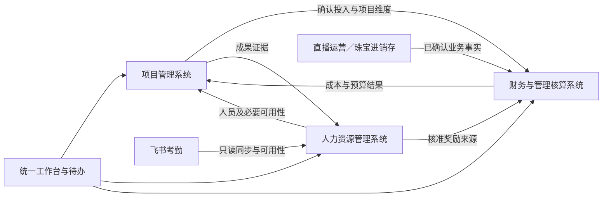

# 标准产品蓝图（内部改造设计稿）

> 版本：v1.1
> 日期：2026-09-07
> 状态：参考通用实践的内部改造设计稿；三个业务系统的方向已明确，P1 交付/核算字段和流程已本地实现，见 [实施记录](./P1-交付与核算解耦实施记录.md)；其余能力仍分批实现，不代表完成标准产品验证
> 代码盘点基准：`codex/system-baseline` / `6250de1e`，数据库迁移文件至 V062
> 本阶段交付：能力地图、业务边界、状态与权限、集成契约、差距清单和实施批次；不包含业务代码上线
> v1.1：统一三个系统及下级菜单，明确项目 KPI、员工绩效、奖金激励、成本与支付的归属；先看[三系统拆分方案：审阅版](./三系统拆分方案-审阅版.md)

## 1. 阅读入口与决策边界

| 文档 | 回答的问题 |
|---|---|
| [三系统拆分方案：审阅版](./三系统拆分方案-审阅版.md) | 用业务语言审阅系统数量、菜单、KPI 与奖金归属、流程图和分批范围 |
| 本文 | 产品由什么组成、谁负责什么、哪些能力自建或集成、各模块如何协作 |
| [标准项目管理：业务流程与数据设计](./标准项目管理-业务流程与数据设计.md) | 项目如何启动、计划、执行、记录投入、验收和关闭；需要什么业务对象与约束 |
| [飞书考勤：集成契约与切换设计](./飞书考勤-集成契约与切换设计.md) | 外部员工如何映射、同步什么、怎样处理未知／撤销／修正、本地请假怎样退出 |
| [标准产品：改造差距与实施清单](./标准产品-改造差距与实施清单.md) | 当前代码与目标的差距、逐批改哪些代码、依赖、验收与回退条件 |
| [系统模块拆分调研与建议](./系统模块拆分调研与建议.md) | 行业参考依据、方案演变与当前代码初步盘点 |

已经明确的方向：以项目管理为核心，采用通用模型，当前先服务公司内部改造；统一平台下设置项目管理系统、人力资源管理系统、财务与管理核算系统三个业务子系统。原有直播与珠宝作为两个行业应用保留；考勤沿用飞书并接入结果。早前“只能用天、必须删掉百分比、八个系统并列”等个性化推断不作为本轮依据。

本文件所称“系统”是业务职责和导航分组，不要求三套独立网站、账号或部署服务。系统之下再设业务模块；KPI、绩效和奖金有各自入口，不增加第四或第五个通用系统。长期标准产品目标保留，但还需补目标客户、可选模块依赖、配置边界、首次交付和跨组织验证。

本文件区分产品目标、首轮改造和现有能力。默认审批方式、状态名、字段名和批次是本轮形成的工程设计，不是 ISO 条文，也不能据此声称所有能力已经存在。旧文档保留业务历史，运行现状以代码和实际迁移记录为准。

## 2. 产品组成与价值

| 产品域／应用 | 核心使用者 | 核心工作 | 与其他域的边界 |
|---|---|---|---|
| 项目管理系统 | 发起人、项目经理、成员、交付验收人、项目治理人 | 确定目标、安排资源、推进工作、项目 KPI、处理变更和风险、交付验收 | 管项目投入和交付，不办理出勤、不维护员工工资 |
| 人力资源管理系统（HCM） | 员工、人事、主管、薪酬激励人员 | 维护人员与任职、查询外部假勤；分别管理员工绩效和奖金激励 | 项目指标可作为证据；绩效、奖励各自有权限与流程，飞书办理假勤 |
| 财务与管理核算系统 | 预算负责人、核算人员、授权管理者 | 预算控制、费用收支、成本归集、核算与经营分析；后续接入支付结果 | 提供权威金额结果；不重复创建项目实际投入或员工评价 |
| 直播运营 | 主播、直播复核人、运营人员 | 日报、流水、客户维系与业务指标 | 行业记录留在直播域，提供有口径和来源的事实 |
| 珠宝进销存 | 制单人、审核人、库存与业务管理者 | 商品、采购、销售、库存、盘点与组装 | 原单据、库存与成本规则继续由珠宝域维护 |



同一平台、账号和人员标识可复用，业务权限不因此合并。以上箭头是领域间数据职责，不代表已经存在接口或需要消息中间件。首先在现有模块化单体中实现清楚的服务接口与可靠事务。

## 3. 标准能力与本轮范围

“首轮”指此次标准化的若干开发批次，不是第一批同时实现所有行。

| 能力 | 当前基础 | 首轮处理 | 后续产品能力 |
|---|---|---|---|
| 项目生命周期与治理 | 负责人自主启动；部分旧审批仍兼容；关闭与 KPI、请假、核算耦合 | 版本化流程、交付与核算分离、模板关闭检查、旧记录兼容 | 更丰富的项目组合与多项目治理 |
| 工作执行 | 成员、任务、持续工作、风险、进度、验收 | 明确角色、完成口径、计划基线和变更记录 | 高级排程、资源自动平衡 |
| 资源与实际投入 | 计划／实际百分比；立项自然日测算 | 工作日历、独立分配区间、计划工作量、已确认实际记录 | 更丰富资源类型和容量预测 |
| 项目指标 | 项目 KPI 目标、自动来源、周期结算 | 纯指标可独立配置；结果有来源；与奖金分状态 | 跨项目指标库与趋势 |
| 组织人员 | 账号、公司部门、人员扩展档案 | 主档归属清楚，角色与成本权限分离，外部员工映射 | 完整岗位任职／入离职等 HR 流程 |
| 假勤 | 本地请假与项目、成本强关联 | 飞书查询、同步状态、只读结果；验证后退出本地办理 | 根据产品市场需要再增加其他提供方 |
| 员工绩效 | 尚无完整个人／部门绩效体系 | 定义独立对象与项目证据接口，不把项目 KPI 改名当成员工绩效 | 目标、评价、复核、结果发布完整流程 |
| 薪酬激励 | 项目奖金池及成本记录 | 奖金方案／核准记录与项目测量分离，保留历史来源链 | 个人分配、薪资处理和支付集成 |
| 管理核算 | 费用事实、项目日结果、人员和奖金成本 | 来源统一、成本政策归属、项目结算状态、确认和更正 | 实际工资分摊及更完整期间管理 |
| 完整财务／工资 | 不具备完整总账、工资单和支付闭环 | 预留边界，不做空菜单或假付款状态 | 按产品路线图建设或集成 |
| 直播／珠宝 | 已有独立业务 | 保持口径和权限，定义可引用的来源 | 行业扩展按独立需求演进 |

## 4. 菜单与工作台

以下是目标信息架构，固定为三个业务系统下设置功能菜单，不采用五个平级业务入口。未交付模块不显示可操作的空入口；各用户只显示获授权且已启用的能力。原有两个行业应用及共享管理入口单独保留。

```text
工作台
项目管理系统
  项目列表与立项
  任务与持续工作
  计划与里程碑
  人员安排与实际投入
  项目 KPI／指标
  风险、问题与变更
  成果验收与结项
人力资源管理系统
  组织与人员
  飞书假勤查询（只读）
  绩效管理（员工及团队考核）［后续完整能力］
  奖金激励
    奖金方案与项目奖金台账
    个人分配［后续能力］
财务与管理核算系统
  预算与测算
  费用和收支记录
  成本政策与人员成本
  项目核算与结算
  经营报表
  支付记录／外部发薪结果［后续集成］
直播运营
珠宝进销存
系统与集成
  账号、角色与数据权限
  流程模板、字典与审计
  飞书连接、人员映射与同步记录
```

| 工作台视角 | 首屏要回答的问题 | 聚合原则 |
|---|---|---|
| 管理者 | 哪些项目延期、风险或超预算，哪些决策待处理 | 按授权范围汇总；可见项目目录不自动等于可见全部经营和人员信息 |
| 项目经理 | 哪些任务阻塞、谁有资源冲突、哪些投入或成果待确认 | 聚合项目操作，不把 HR 请假审批搬回工作台 |
| 成员 | 分配给我什么、何时完成、哪些记录被退回 | 本人任务、投入和反馈；不展示其他人的敏感成本 |
| 人事／核算 | 哪些人员未映射、哪些同步异常、哪些金额待复核 | 待办来自所属模块，点击后回到原始业务单据 |

项目详情可展示 KPI、奖励、考勤可用性和成本摘要及跳转入口；其写入责任和权限仍归对应模块。

KPI 按用途归属：项目成果指标在项目系统；用于员工或团队评价的指标在 HCM 绩效模块。营收、利润、库存等事实继续由原业务系统或核算维护，评价模块只引用有口径和版本的证据。当前项目奖金池不直接迁造成个人绩效或已支付给员工的奖金。

## 5. 业务对象与唯一责任

对象名为逻辑模型，不是既有数据库表或 API 声明。各对象共享来源、创建修改人、版本、组织范围和审计要求。

| 逻辑对象 | 关键标识／字段 | 唯一维护方 |
|---|---|---|
| EmployeeProfile | 人员标识、员工编号、组织／任职有效期、人员状态 | HCM；首轮沿用 `sys_user.user_id` 和扩展档案，不重建账号 |
| ExternalPersonMapping | 连接／企业范围、外部 ID 类型和值、内部人员标识、映射状态 | 集成模块；一条外部身份在有效期内不能映射多个本地人员 |
| Project / ProjectBaseline | 项目标识、组织、负责人、流程策略版本、范围与计划基线 | 项目管理 |
| ResourceAssignment | 人员、项目／任务、有效区间、日历版本、单位政策版本、分配方式、计划量 | 项目管理；不等同出勤 |
| WorkEntry | 人员、项目／任务、工作日期、数量与单位、分钟／人天换算快照、确认状态、修订链 | 项目管理；实际成本只使用适用规则下已确认记录 |
| ProjectMetric / Measurement | 项目／阶段、单位、公式与来源版本、周期、结果、证据 | 项目管理；采集人不是员工绩效的被评价人 |
| PerformanceReview | 被评价员工、周期、目标、自评、主管评价、复核与发布 | HCM 绩效；项目成果只提供证据 |
| RewardPlan / RewardAward | 来源项目或评价、币种、预算、测算、核准金额、规则版本 | 薪酬激励；金额必须区分测算与核准 |
| RewardAllocation | 奖励来源、受益人员、分配金额与批准版本 | HCM 奖金激励；后续建设，核准金额与个人分配分别记录 |
| PaymentEvidence | 支付来源、金额、日期、状态、外部凭证 | 财务与管理核算／外部工资支付系统；后续集成，不从现有奖金成本伪造付款 |
| CostPolicy / CostEntry | 费率及生效期、成本对象、来源行、金额币种、确认与调整链 | 管理核算；项目使用其结果，不自行建立第二份实际金额 |
| AttendanceObservation | 来源记录、人员、业务日期／时段、时区、单位、状态、同步版本 | 飞书原始数据，网站集成只读映射；未知不等于缺勤 |

项目、人员、原单据和成本对象之间使用稳定 ID 关联。字段重命名不改变既有主键或历史引用；新增物理表和 API 在对应编码批次中落地，不抢占尚未确定的数据库迁移编号。

## 6. 各模块状态与默认流程

项目完整迁移表见[项目流程设计](./标准项目管理-业务流程与数据设计.md)。以下默认值是产品方案，发布后按版本生效。

| 流程 | 推荐默认步骤 | 与项目关闭的关系 |
|---|---|---|
| 项目交付 | 立项／计划 → 执行 → 验收 → 已关闭；轻量与受控模板控制必要批准 | 只控制执行和交付；不自动把核算、绩效或奖励改成完成 |
| 实际投入 | 草稿 → 提交 → 确认，或退回；确认后通过修订／调整处理 | 关闭前工作日期的迟报按结算政策处理，不开放任意新增执行活动 |
| 项目测量 | 草稿 → 提交 → 确认；自动取数预览和冻结结果分开 | 允许对关闭项目的既有周期形成结果；纯指标不要求奖金阶梯 |
| 员工评价〔后续〕 | 目标确认 → 评价中 → 待复核 → 已发布 → 归档 | 可在项目交付后继续评价，不修改项目历史成果 |
| 奖励金额 | 草稿／测算 → 待审核 → 核准，或退回／作废 | 核准产生可供核算引用的业务来源，不等于发放 |
| 个人奖励分配〔后续〕 | HCM 中分配草稿 → 待审核 → 批准 | 不再次生成相同奖金成本；分配总额不得超过适用核准金额 |
| 支付及结果核对〔后续〕 | 财务／外部工资支付系统办理；按凭证记录支付状态 | HCM 可按权限引用状态；奖金核准或成本确认不自动证明已支付 |
| 成本确认 | 草稿 → 待确认 → 已确认；错误使用关联调整 | 项目交付后，在项目核算开放且期间允许时仍可处理 |

首轮过渡模型采用独立的项目 `accountingState = OPEN / CLOSED`，与交付 `status` 分离。它表示这个项目是否还接受结算操作，不等于企业会计期间是否锁定；未来期间 `OPEN / LOCKED` 是另一层控制。影响成本的结算操作须同时满足所属流程、业务日期、项目核算状态和已实现的期间控制；纯指标与员工评价按自身状态续办。P1 保留的旧 KPI＋奖金联动仍受核算开放约束，P3 拆分后分别校验。

默认将无 KPI／无奖金的正常交付视为允许场景。模板可以增加有依据的合同、成果或财务检查，但不能把员工评价、飞书同步成功或任何未来奖金周期写死为所有项目关闭条件。

### 成本来源与防止重复

- 首轮新口径采用已确认实际投入与对应生效内部费率形成管理成本；预算来自计划投入。百分比可参与计划推算，不能直接标为已核实实际。
- 内部标准计价与未来真实工资分摊是不同口径，分别展示；同一成本类别切换方法要有生效日与调整，不将两者叠加。
- 奖励核准后生成管理成本待确认来源，核算确认才进入新口径实际结果；旧版已经确认的奖金成本继续按旧来源保留。
- 个人分配和付款是同一奖励来源的后续处理，不再次计入项目成本。核准差额走调整。
- 成本幂等身份至少包含组织、来源域、来源单号／行号、成本类别；同一经济事件的重试不能产生新成本。规则版本用于追溯，不能仅通过提高版本绕过经济事件唯一性。
- 金额、币种、单位、费率、实际量、来源版本和确认时间可下钻；未配置或同步失败明确显示待完善。

## 7. 角色与权限默认值

权限计算同时考虑功能、组织／项目范围、字段敏感级别和当前状态。以下是目标默认，不立即改变现有角色权限。

| 操作 | 默认发起／维护角色 | 默认确认角色 | 关键边界 |
|---|---|---|---|
| 立项与范围变更 | 获授权发起人／项目经理 | 模板指定治理角色；轻量模式可直接发布 | 公司与项目范围不得因新菜单扩大 |
| 任务、排期与成果 | 项目经理／被分配成员 | 指定成果验收角色 | 成员不能修改未授权任务或项目基线 |
| 实际投入 | 员工本人；经理代录保留代录标识 | 项目经理／指定复核人 | 经理本人投入默认由另一个指定复核人确认；轻量自确认须策略明确 |
| 项目测量结果 | 指标负责人／项目经理 | 指定项目业务复核角色 | 自动取数仍留来源与冻结时间 |
| 人员档案 | 人事管理员 | 涉及组织敏感变更按组织流程 | 项目经理不因参项关系获得全部人事写权限 |
| 外部考勤连接 | 集成管理员 | 企业应用授权与平台配置职责 | 业务用户不能读取密钥；同步可见范围不直接继承给页面 |
| 员工绩效〔后续〕 | 本人及授权主管 | 绩效复核角色 | 本人不能最终发布自己的评价 |
| 奖励方案与金额 | 薪酬／激励角色 | 奖励批准角色 | 默认创建者与最终核准者分离，不默认管理员代批 |
| 成本确认与调整 | 项目费用提交人／核算人员 | 核算复核角色 | 默认创建者与复核者分离，金额调整保留原记录 |
| 项目核算关闭 | 核算角色 | 授权核算复核角色 | 先检查未处理来源和金额，不由项目交付按钮隐式执行 |

角色名称与授权对象可配置；例外必须在策略中明确并留审计，不用新增一个“超级老板”绕过所有模块。平台管理员负责技术配置，运维审计的全量访问如保留，应作为单独权限说明，不自动附带业务批准权。

迁移时保留既有公司归属、项目归属老板、角色与个人菜单限制的有效范围；需要改变范围时显式映射并逐角色验证，不能简单将旧老板角色换成全公司管理员。

## 8. 模块间契约与一致性

| 数据变化 | 来源负责的事实 | 下游行为 |
|---|---|---|
| 人员组织更新 | HCM 提供人员标识、任职有效区间与状态 | 新安排校验有效关系，历史参与关系不随调岗改写 |
| 实际投入确认／调整 | 项目提供记录 ID、工作日期、数量、单位、单位政策与日历版本、修订关系 | 核算按方法生成／调整来源记录，处理失败可重试并显示待核算 |
| 项目成果确认 | 项目提供结果版本、证据和公开范围 | 绩效或奖励读取有权限的结果快照，不复制执行流程 |
| 奖励金额核准／调整 | 激励模块提供来源、金额币种及核准版本 | 核算创建可幂等确认的成本来源，付款模块只处理支付 |
| 核算完成 | 核算提供来源覆盖范围、状态和结果版本 | 项目和经营报表显示同一结果，并说明数据截至时间 |
| 飞书结果变化 | 集成提供标准观察记录、覆盖状态与版本 | 项目更新可用性提示，不能自动生成项目实际投入或改写锁定成本 |

每个契约区分事件事实和处理结果。现有单库可用业务事务加待处理记录实现可靠性；只有确有跨服务需求时再选消息机制。只读查询不应现场重算并写入大量项目数据。

项目关闭后的费用、测量和奖励处理需使用各自接口的状态规则；前端隐藏按钮、AI 能力和旧接口也必须一致。任何一处继续依据 `project.status == CLOSED` 全面拒绝结算，都会破坏拆分后的流程。

## 9. 默认配置与外部依赖

| 项目 | 产品默认／处理方式 | 实施时需要的输入 |
|---|---|---|
| 组织与角色 | 通用组织关系和项目角色，保留历史映射 | 现有角色与数据范围的迁移核对 |
| 项目模板 | 轻量／受控；默认不绑定员工绩效和奖金结算 | 内部改进、客户交付、持续服务三个样例验证 |
| 工作量 | 工作日历计算容量，单位政策确定分钟／人天；分别保存版本和快照，支持人时／人天及比例计划 | 有效工作日历与单位政策；日历改变不重写历史人天换算 |
| 金额 | 保留原币与管理核算币种，费率按生效区间 | 现有内部成本政策与样本对账；不引入未经确认的汇率来源 |
| 飞书 | 后端读取、员工映射、标准结果与同步状态 | 企业应用、授权范围、实际可读字段与脱敏样本；不需要在对话中提供密钥 |
| 语言与时区 | 文案进入资源层，业务日期记录时区依据 | 首轮不降低既有直播中越双语；新增页面按发布语言集验收 |

飞书授权是联调前提，不阻塞项目状态、工作量模型、权限与适配层契约开发。没有授权时只验证本地样例和契约，不能声称真实同步通过，也不能提前退出原流程。

## 10. 实施与设计验收

详细任务、依赖和回退见[实施清单](./标准产品-改造差距与实施清单.md)。首个编码批次聚焦：版本化流程策略、项目交付与核算状态分离、关闭后的合法结算、相应权限／页面／AI 一致性。

该批不同时重写全部绩效和奖金模型。未切换旧项目继续执行旧语义，已关闭旧账保持封存；后续批次才启用独立奖励来源、实际投入模型和飞书切换。这样每一批均可独立核对业务结果。

| 设计验证场景 | 应成立的结果 |
|---|---|
| 内部改进项目，没有收入和奖金 | 能安排任务、记录投入、验收和结束，不要求虚构经营指标 |
| 客户交付完成，费用次日补报 | 交付已关闭，核算开放时可处理合法结算；项目状态不被重新打开 |
| 持续服务项目跨季度 | 服务执行、周期指标、奖励和核算各自推进，季度结果不强制终止服务 |
| 一个员工跨两个项目兼职 | 日历、容量、计划和实际分别可解释，不因有两条成员关系重复计整天 |
| 飞书请假修正或接口失败 | 修正有来源版本；失败显示未知，不能推断缺勤、零投入或零成本 |
| 奖励已核准但未支付 | 明确显示金额状态与支付状态，分配或支付不再重复生成成本 |
| 已确认历史成本或旧 KPI | 结果继续可追溯；迁移不重算历史、不改变原确认责任人 |
| 创建者、复核者、管理员、两位老板 | 按作用域和角色验证，用户既有隔离不因标准菜单扩大 |

设计交付检查包括链接和状态一致性、现状证据、迁移依赖与验收覆盖。代码实施后再运行受影响后端测试、前端 `pnpm run build:prod`、权限场景和真实样本对账；不把文档检查冒充业务验证。

## 11. 依据与适用范围

项目能力边界参考 [ISO 21502 公开范围](https://www.iso.org/standard/74947.html)及 [PMI PMBOK 官方介绍](https://www.pmi.org/standards/pmbok)；资源模型参考 [Microsoft Project](https://support.microsoft.com/en-us/project/learn-more-about-resource-units)；HR 模块参考 [Zoho People](https://www.zoho.com/people/features.html)；奖励与成本来源参考 [Frappe HR 附加薪资](https://docs.frappe.io/hr/additional-salary)及 [ERPNext 项目成本](https://docs.frappe.io/erpnext/project-costing)。外部资料解释通用实践，本文状态、角色和分批方案是针对本产品的设计。

HCM 中分设绩效和激励模块另参考 [SAP 绩效目标管理](https://www.sap.com/products/hcm/performance-goals.html)与[SAP 浮动奖金管理](https://help.sap.com/docs/successfactors-compensation/implementing-and-managing-variable-pay/sap-successfactors-variable-pay)。这些参考支持职责划分，不规定本项目必须拆成三个系统。

本轮不建设自有考勤、招聘、全地区工资税费、银行支付、公有云租户计费或完整财务总账。这些能力已明确归属与接口方向，是否建设由后续产品版本决定。
