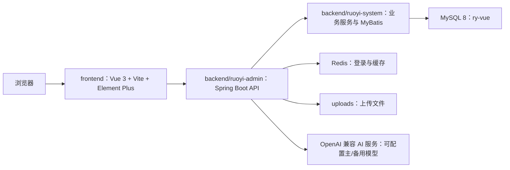
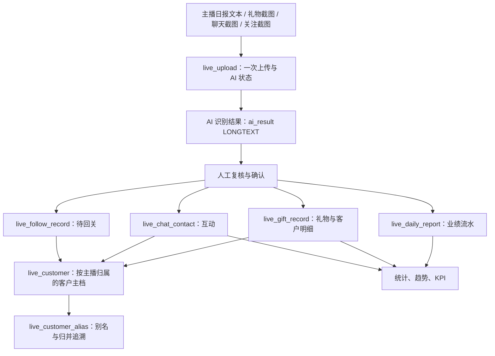

# meimaru 管理系统：架构与数据库基线

> 基线日期：2026-08-04。本文描述当前单体仓库和代码实际依赖；历史设计、交接记录不能替代本文与迁移脚本。

## 1. 系统边界

本仓库包含两个相互独立的业务域，共用 RuoYi 的用户、角色、菜单、审计和登录能力。

- 直播数据管理：上传日报或截图、AI 识别、人工复核、客户归并、统计分析、KPI、关注维系。
- 珠宝 ERP：员工、商品、供应商、库存、业务单据、审批、库存流水和组装。

除账号、权限、基础设施等公共能力外，两个业务域的表、服务、接口和页面应保持独立。

## 2. 代码结构

| 位置 | 责任 |
|---|---|
| `frontend` | 当前 Vue 3 前端；业务页面在 `src/views/live`、`src/views/jewelry`，API 封装在 `src/api/live`、`src/api/jewelry` |
| `backend/ruoyi-admin` | 应用入口和 REST Controller；直播接口位于 `web/controller/live` |
| `backend/ruoyi-system` | 领域对象、服务、Mapper 和 XML SQL；直播代码位于 `com.ruoyi.live` 与 `mapper/live` |
| `backend/ruoyi-framework` | Spring Security、登录、数据权限和框架配置 |
| `backend/ruoyi-common` | 公共工具、异常、注解和基础对象 |
| `backend/ruoyi-quartz` | 定时任务 |
| `backend/ruoyi-generator` | RuoYi 代码生成器 |
| `backend/ruoyi-ui` | RuoYi 自带的旧 Vue 2 前端，不是本项目当前业务前端 |
| `backend/sql/migrations` | 可重复执行、不得主动删除业务数据的直播数据库基线迁移与校验 |

本地常规启动入口是仓库根目录的 `start-dev.bat`。后端启动前需确认 MySQL 和 Redis 均可用。文件目录通过 `ruoyi.profile` 配置，生产环境应覆盖成本机之外的持久化路径。

## 3. 直播数据链路

AI 状态：`0` 待识别、`1` 已识别、`2` 已确认入库、`3` 失败、`4` 识别中。模型返回值保存在 `LONGTEXT` 中，由应用层校验和修复 JSON；数据库不强制使用 JSON 类型。

### 统计口径

| 指标 | 唯一业务数据源 |
|---|---|
| 流水、趋势、流水 KPI | `live_daily_report.total_xu` |
| 礼物金额、打赏客户、高价值客户 | `live_gift_record` |
| 聊天客户、有效互动、维系状态 | `live_chat_contact` |
| 待回关 | `live_follow_record` |

日报流水和礼物截图合计允许不一致，它们服务于不同目的。详细定义见 [统计口径说明.md](./统计口径说明.md)。

### 客户身份约束

- 客户身份以 `(nickname, streamer_id)` 为作用域，同名客户可属于不同主播。
- 客户只能合并到同一主播下的另一个未归并客户。
- 合并时礼物、聊天和关注记录遇到同日唯一键冲突必须聚合，不能直接改外键造成唯一键异常或丢数据。
- 别名记录必须保留 `streamer_id`，以免跨主播错误识别。

## 4. 数据库基线

直播域当前包含 11 张表：

`live_streamer`、`live_customer`、`live_upload`、`live_gift_record`、`live_chat_contact`、`live_chat_message`、`live_daily_report`、`live_follow_record`、`live_customer_alias`、`live_kpi_config`、`live_weiji_stats`。

珠宝域当前包含 9 张核心表：

`jewelry_staff`、`jewelry_product`、`jewelry_supplier`、`jewelry_stock`、`jewelry_document`、`jewelry_document_item`、`jewelry_approval`、`jewelry_document_event`、`jewelry_stock_transaction`。

### 迁移规则

1. 修改业务表前先增加新的有序迁移，不回写已执行迁移的含义。
2. 现有库先备份，再按 `backend/sql/migrations/README.md` 的顺序执行。
3. 迁移必须支持重复执行，禁止无条件 `DROP TABLE`、清空或覆盖业务数据。
4. 完成后执行 `verify_business_schema.sql`；`missing_*`、`*_mismatch`、`orphan_*` 必须全部为 `0`。
5. 菜单和角色按稳定的 `menu_id`、`role_key` 管理，不依赖某个环境中的自增 `role_id`。

兼容入口 `backend/sql/live_tables.sql` 与 `backend/sql/live_role_menu.sql` 只转调安全迁移，不再重建业务表。

## 5. 权限与角色

业务角色以 `role_key` 为稳定标识：直播管理员 `live_admin`、数据录入员 `operator`、主播 `streamer`，以及珠宝管理员、审核员、制作人员。Controller 的每个业务端点都必须声明 `@PreAuthorize`。

- 主播：只访问与本人绑定的主播数据。
- 录入员：上传并查看数据，不获得复核确认和后台配置权限。
- 直播管理员：主播、复核、统计和 KPI 管理权限。
- 珠宝单据：创建人、审核人、管理员按单据状态和专用权限执行提交、撤回、审核、驳回、冲销。

菜单支持中文 `menu_name` 和越南语 `menu_name_vi`；新增或修改用户界面时应同步检查两种语言。

## 6. 配置和安全

- 数据库密码、AI Key、生产地址和管理员密码不得写入文档、迁移或版本库。
- `logs/`、`uploads/`、前后端构建产物和本地数据库配置不得提交。
- AI 服务使用 `sys_config` 中的配置，文档只记录配置键，不记录实际 Key。
- 生产部署需在明确授权后进行：只提交目标文件、推送当前分支、备份服务端制品、部署并检查页面和 API 健康。

## 7. 变更验收

- 直播统计修改：核对 Mapper SQL，并用至少一条真实记录对账日报与礼物明细。
- 客户归并修改：验证同主播成功、跨主播拒绝、已归并客户拒绝、同日记录正确聚合。
- 权限修改：验证创建人/录入员、复核人、管理员或对应业务角色。
- 后端：运行受影响模块测试；合并前运行 Maven 全量测试。
- 前端：运行 `pnpm run build:prod`，并检查中越双语页面。
- 数据库：在临时空库和升级场景执行迁移，再运行基线校验脚本。

## 8. 文档优先级

发生冲突时按以下顺序判断：

1. 已确认的最新业务需求和 `统计口径说明.md`。
2. 本文、当前代码和 `backend/sql/migrations`。
3. 领域需求文档（例如珠宝 ERP 第一阶段设计）。
4. 标记为“历史快照”的完整文档、交接说明和下一阶段设计。
